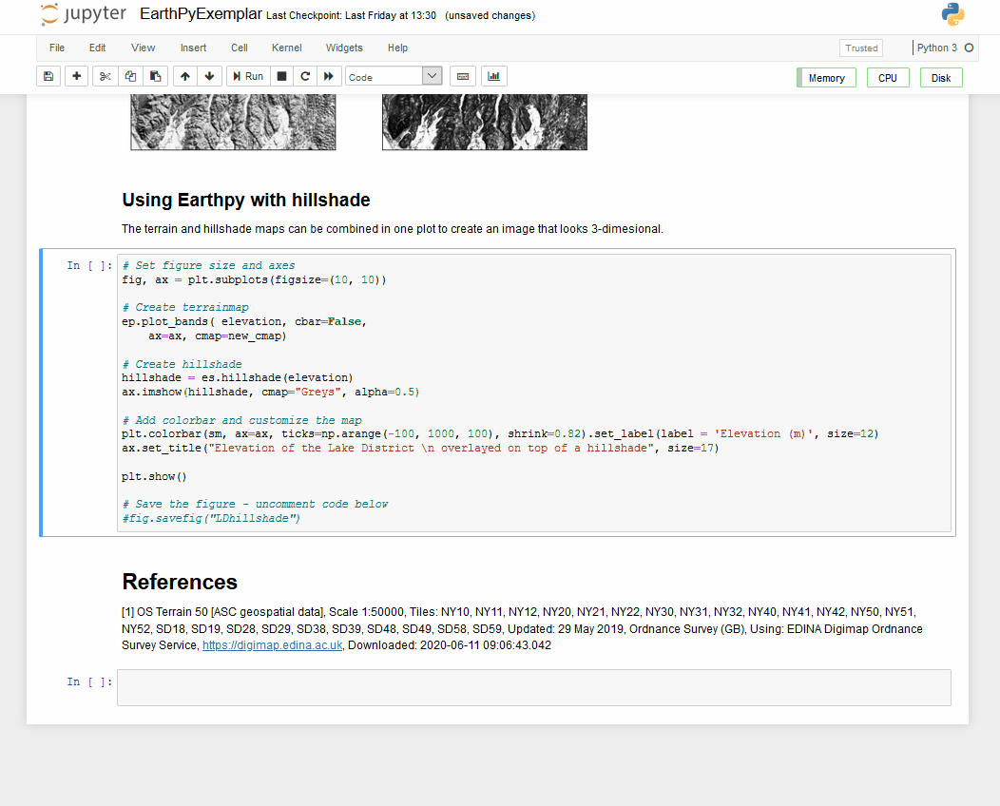

# Noteable Jupyter notebook Exemplars 2020/21

Guides, tutorials and exemplar notebooks for the Noteable service.

This repo is divided into topical exemplars which make use of the Noteable service's feature to manage additional libraries and packages for programming with. The main goal of Noteable as a service is to provide a managed, centralised place available online to run and manage computational notebooks. 
In this repo, you will find Jupyter notebooks focussing on Geospatial analysis, Machine Learning, medical analysis and more. 
Coding activities for students include a set of tutorials and exemplar notebooks for reference, adaptation and use in classroom, in accordance with the Scottish Curriculum for Computing Science at National 3, 4, 5, Higher and Advanced Higher levels. 

Further documentation for the Noteable service can be found at: www.notable.edina.ac.uk 

## Description
A collection of resources available for current and prospective users of Noteable.

### Exemplars
A collection of notebook exemplars showcasing different libraries and aspects of Noteable.
* Geospatial Notebooks - run in Geospatial Notebook Server
* Machine Learning Notebooks - run in Standard Notebook Server
* R with Statistics Notebooks - run in R with Stan Notebook Server
* Haskell Notebooks - run in Haskell Notebook Server
For a list of exemplars with short descriptions, please refer to the [Documentations page on the Noteable website](https://noteable.edina.ac.uk/exemplars/).

### Teaching documents
A collection of tutorials, templates and quick reference guides mainly for teaching purposes.
* Tutorials
* Templates
* Quick Reference Guides
For a list of finished teaching tools with short descriptions, please refer to the [Documentations page on the Noteable website](https://noteable.edina.ac.uk/teaching_templates/).
    
### List of libraries
If you are interested in the current packages and their version numbers available in all the live and beta Notebook Servers offered by Noteable.

## Visuals
Here are some excerpts from the exemplars and teaching documents within this repo.

### EarthPy Notebook showing elevation data

### ObsPy Notebook showing seismic signal processing

### KMeans Compression Notebook showing image compression

### Regression Medical Notebook showing medical data analysis

## Usage
The most optimal way to run the notebooks would be through your Noteable account. If you do not have an account with Noteable yet, you can run them locally, although it might require you to install additional packages for some of them. 

### Within Noteable
If you already have a Noteable account, you can easily clone this repository by clicking on `GitRepo+`. This button is located on the right side above your working tree on the launch page. Once you click on it, paste in the url of the github repo `https://github.com/edina/Exemplars2020.git`. This will then make a copy of the current repository which you can run and alter in your Noteable home directory.

### On your local machine
If you do not have a Noteable account yet, you can download the zip file to your local directory or use a desktop git client to clone the repository onto your local directory. Depending on which pakcages you have previously installed on your computer, you might have to use `pip install` or `conda install` to install any missing packages for the notebooks to run smoothly.

## Support
If you have any questions or would like to report a bug, raise an issue at https://github.com/edina/exemplars2020/.

## Contributing
Contributions of exemplar notebooks or teaching documents are welcome, as long as they follow the template and structure provided by [our exemplar template](https://github.com/edina/Exemplars2020/blob/master/GeneralExemplars/ExemplarTemplate.ipynb).

To contribute:
* Fork the project and clone locally.
* Create an upstream remote and sync your local copy before you branch.
* Branch for each separate piece of work.
* Do the work following the structure provided by the exemplar template, provide descriptive commit messages.
* Push to your origin repository.
* Create a new Pull Request in GitHub.
* Respond to any code review feedback.

## Authors and acknowledgements
Dora Hegedus - Student Coding Experience Intern for Noteable, Edina

[Robyn Greene](https://github.com/robyngreene) - Student Coding Experience Intern for Noteable, Edina

Alexandru Hau -Student Coding Experience Intern for Noteable, Edina

## License
[BSD 3-Clause "New" or "Revised" License](https://github.com/edina/Exemplars2020/blob/master/LICENSE)

## Project status
This was a project for Summer 2020 and has mostly been concluded.
